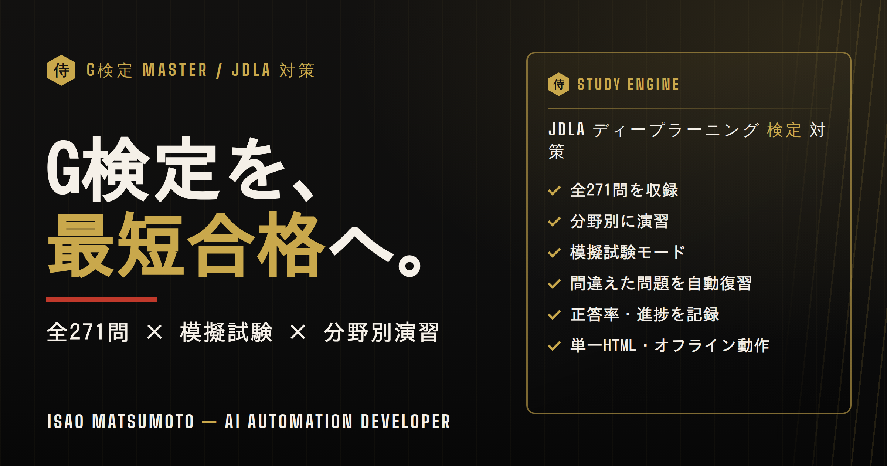

# G検定Master — JDLA G検定 対策アプリ

**ディープラーニング資格「G検定（JDLA）」を、最短合格へ。全271問の分野別演習・模擬試験・間違い復習を1つに。**

---

## 🎯 概要 / Overview

**[日本語]**
JDLA（日本ディープラーニング協会）の **G検定** 対策を、ブラウザだけで完結できる学習アプリです。全271問を収録し、分野別演習・模擬試験・間違えた問題の自動復習で、効率よく合格ラインを目指せます。サーバー不要・APIキー不要の単一HTMLで、オフラインでも動作します。

**[English]**
A browser-only study app for Japan's **G検定** (JDLA Deep Learning for GENERAL certification). 271 questions with topic-based practice, mock exams, and automatic review of missed questions — all in a single, offline-capable HTML file.

---

## ✨ 主な機能 / Features

| 機能 | 内容 |
|---|---|
| 全271問 収録 | ディープラーニング・機械学習・数理・社会実装/法律倫理 などを網羅 |
| 分野別に演習 | 苦手分野を集中的に対策 |
| 模擬試験モード | 本番形式でまとめて挑戦 |
| 間違い自動復習 | 誤答を記録し「間違えた問題を復習」で再挑戦 |
| 進捗・正答率の記録 | 学習状況を可視化（ブラウザ内に保存） |
| 単一HTML・オフライン | サーバー/APIキー不要、インストール不要 |

---

## 🛠️ 技術構成 / Tech Stack

- **HTML5 + CSS3 + Vanilla JavaScript**（外部ライブラリなし）
- データ保存：`localStorage`（進捗・正答率）
- 完全クライアントサイド動作・レスポンシブ対応

---

## 👤 作者 / Author

**松本 勲（Isao Matsumoto）** — AI Automation Developer（元・建築塗装27年 / 自営10年）
現場を知る人間が、AIを実務と学習に落とし込む。

- Email: isao1301111@gmail.com
- LinkedIn: [linkedin.com/in/isao-matsumoto-1b271411b](https://linkedin.com/in/isao-matsumoto-1b271411b)

### 関連プロジェクト
- [samurai-painting-quote](https://github.com/isao1301111-eng/samurai-painting-quote) — 13項目ハルシネーション防止つきAI見積もりツール
- [genba-nippo-tool](https://github.com/isao1301111-eng/genba-nippo-tool) — 打ち込みゼロ 現場日報ツール
